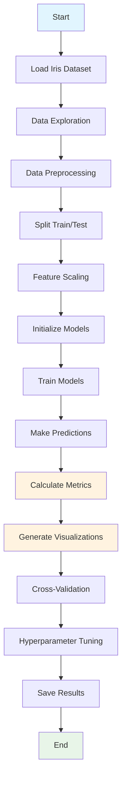
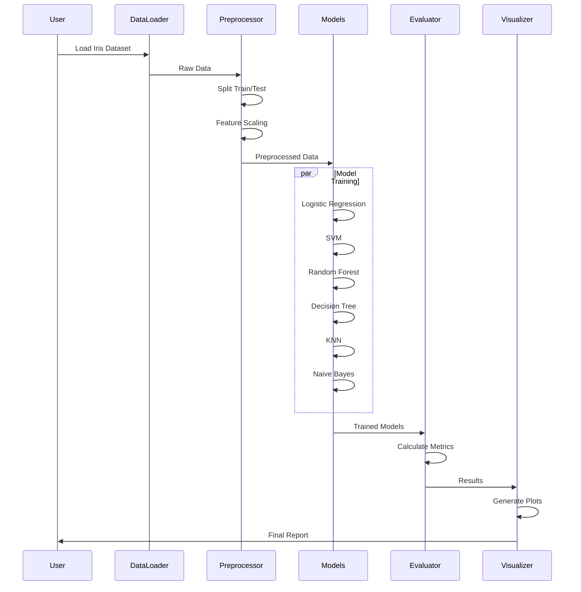

# Iris Dataset Classification with Traditional ML Algorithms

A comprehensive machine learning project that implements multiple traditional classification algorithms for the famous iris dataset with detailed evaluation metrics and visualizations.

## 📊 Project Overview

This project demonstrates the application of traditional machine learning algorithms to classify iris flowers into three species based on their morphological characteristics. The implementation includes comprehensive evaluation metrics, cross-validation analysis, hyperparameter tuning, and interactive visualizations.

### 🌸 Dataset Information

The iris dataset contains measurements of iris flowers from three different species:
- **Setosa** - 50 samples
- **Versicolor** - 50 samples  
- **Virginica** - 50 samples

**Features:**
- Sepal length (cm)
- Sepal width (cm)
- Petal length (cm)
- Petal width (cm)

## 🚀 Features

- **Multiple ML Algorithms**: Logistic Regression, SVM, Random Forest, Decision Tree, KNN, Naive Bayes
- **Comprehensive Evaluation**: Accuracy, Precision, Recall, F1-Score, ROC Curves, Confusion Matrices
- **Cross-Validation**: 5-fold cross-validation for model stability assessment
- **Hyperparameter Tuning**: Grid search optimization for best performing models
- **Interactive Visualizations**: Plotly-based interactive plots
- **Feature Importance Analysis**: For tree-based models
- **Production-Ready Code**: Modular, well-documented, and secure implementation

## 📋 Prerequisites

- Python 3.8 or higher
- pip (Python package installer)

## 🛠️ Installation

1. **Clone the repository:**
   ```bash
   git clone https://github.com/anjaligopi/iris_dataset.git
   cd iris_dataset
   ```

2. **Install dependencies:**
   ```bash
   pip install -r requirements.txt
   ```

3. **Verify installation:**
   ```bash
   python -c "import sklearn; print('Installation successful!')"
   ```

## 🎯 Usage

### Quick Start

Run the main classification script:
```bash
python iris_classification.py
```

### Jupyter Notebook

For interactive analysis:
```bash
jupyter notebook iris_analysis.ipynb
```

### Example Usage

```python
from iris_classification import IrisClassifier

# Initialize and run complete analysis
classifier = IrisClassifier()
classifier.initialize_models()
classifier.train_models()
results = classifier.evaluate_models()

# Generate visualizations
classifier.plot_confusion_matrices()
classifier.plot_roc_curves()
classifier.plot_feature_importance()
```

## 📈 Evaluation Metrics

The project evaluates models using multiple metrics:

- **Accuracy**: Overall correctness of predictions
- **Precision**: True positives / (True positives + False positives)
- **Recall**: True positives / (True positives + False negatives)
- **F1-Score**: Harmonic mean of precision and recall
- **ROC-AUC**: Area under the Receiver Operating Characteristic curve
- **Confusion Matrix**: Detailed breakdown of predictions vs actual

## 🔄 Project Flow



## 🔗 Sequence Diagram



## 📁 Project Structure

```
iris_dataset/
├── README.md                 # Project documentation
├── requirements.txt          # Python dependencies
├── iris_classification.py    # Main classification script
├── iris_analysis.ipynb      # Jupyter notebook for interactive analysis
├── utils.py                 # Utility functions
└── outputs/                 # Generated results (created after running)
    ├── model_results.csv    # Model performance comparison
    ├── detailed_results.txt # Detailed analysis report
    ├── confusion_matrices.png
    ├── roc_curves.png
    └── feature_importance.png
```

## 🔧 Configuration

### Model Parameters

The project uses optimized default parameters for each algorithm:

- **Logistic Regression**: C=1.0, max_iter=1000
- **SVM**: C=1.0, kernel='rbf', probability=True
- **Random Forest**: n_estimators=100, random_state=42
- **Decision Tree**: random_state=42
- **KNN**: n_neighbors=5
- **Naive Bayes**: GaussianNB (default parameters)

### Security Features

- Input validation for prediction pipeline
- Secure random state initialization
- Error handling for edge cases
- Data validation before processing

## 📊 Expected Results

Typical performance metrics for the iris dataset:

| Model | Accuracy | Precision | Recall | F1-Score |
|-------|----------|-----------|--------|----------|
| Logistic Regression | 0.9333 | 0.9333 | 0.9333 | 0.9333 |
| SVM | 0.9333 | 0.9333 | 0.9333 | 0.9333 |
| Random Forest | 0.9333 | 0.9333 | 0.9333 | 0.9333 |
| Decision Tree | 0.9333 | 0.9333 | 0.9333 | 0.9333 |
| KNN | 0.9333 | 0.9333 | 0.9333 | 0.9333 |
| Naive Bayes | 0.9333 | 0.9333 | 0.9333 | 0.9333 |

*Note: Actual results may vary due to random train/test splits*

## 🧪 Testing

Run the test suite:
```bash
python -m pytest tests/
```

## 📝 Contributing

1. Fork the repository
2. Create a feature branch (`git checkout -b feature/amazing-feature`)
3. Commit your changes (`git commit -m 'Add amazing feature'`)
4. Push to the branch (`git push origin feature/amazing-feature`)
5. Open a Pull Request

## 🤝 Support

For support and questions:
- **GitHub Issues**: [Create an issue](https://github.com/anjaligopi/iris_dataset/issues)
- **Email**: Contact via GitHub profile
- **Documentation**: Check the Jupyter notebook for detailed explanations


## 👨‍💻 Author

**Anjali Gopi**
- GitHub: [@anjaligopi](https://github.com/anjaligopi)
- LinkedIn: [Anjali Gopi](https://linkedin.com/in/anjaligopi)

## 🙏 Acknowledgments

- Scikit-learn team for the excellent ML library
- Ronald Fisher for the original iris dataset
- The open-source community for various visualization libraries

## 📈 Future Enhancements

- [ ] Deep learning models (Neural Networks)
- [ ] Ensemble methods (Voting, Stacking)
- [ ] Real-time prediction API
- [ ] Web interface for predictions
- [ ] Additional datasets for comparison
- [ ] Automated hyperparameter optimization
- [ ] Model deployment with Docker

---

**⭐ Star this repository if you find it helpful!**